# Order Book Mini Project Overview

## introduction to the project
This project uses the springboot technology stack, which can easily start a web service. The project includes back-end code and front-end code;
The backend has 5 interfaces: 
1. addOrder（http://localhost:9098/trade/add-order）
2. getBuyBook（http://localhost:9098/trade/get-buy-book）
3. getSellBook（http://localhost:9098/trade/get-sell-book）
4. getLatestTrade（http://localhost:9098/trade/get-latest-trade）
5. cancelOrder（http://localhost:9098/trade/cancel-order）

Front end includes 2 pages: 
1. add order（http://localhost:9098/home.html）
2. cancel order（http://localhost:9098/cancel.html）

The project directory structure is as follows：
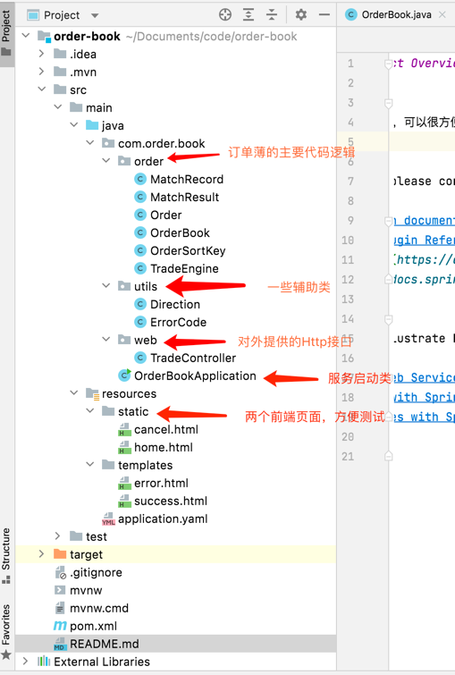

## Project usage guidelines

### web service start
two ways: 
1. Java command to start: java -jar order-book.jar (After executing the command mvn clean package in the project and directory, you can find it in the target directory)
2. Source code startup method:
   1. Open the OrderBookApplication class
   2. right click->RUN 'OrderBookApplication' main() 

When you see this log, it means that the startup was successful.
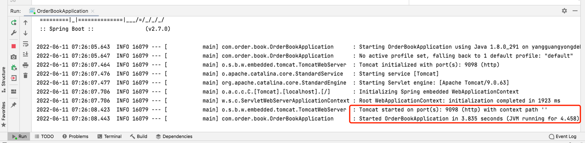

Note: The default port number for the project is 9098

### Functional Guidelines

After the service is started, there is no data at first, and no data is returned in the interface for viewing the buy order book, sell order, and obtaining the latest transaction record.

#### Add buy and sell order data
1. Visit the add order page, prepare to add some data to the system, the first order: sell 5 shares at $110

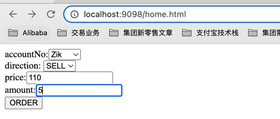

Looking at the seller's order book, you can see the $110, 5-share sell order just added

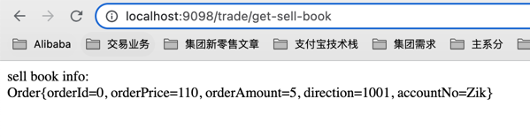

2. Continue to the add order page, add second order: buy 10 shares at a price of $90, and check the buyer's order book after adding

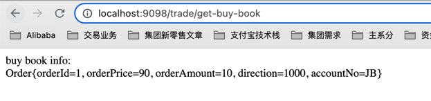

3. add sell order, sell 10 shares at $110, seller order book

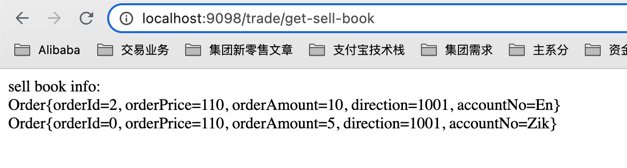

4. Add sell orders for $105, 3 shares, 7 shares; $90, buy orders for 2 shares, 3 shares; $100, buy orders for 4 shares, 6 shares

buyer order book:
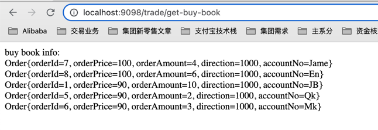

seller order book
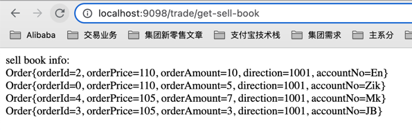

5. An aggressive buyer add an order of $105 to buy 4 shares, which will be matched to 3 shares with orderId=3 + 1 share with orderId=4 in the seller's order book.

The latest transaction record returns 2 orders

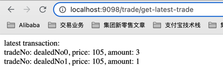

Standard output log print: new order, orderId=9, 2 buy transactions

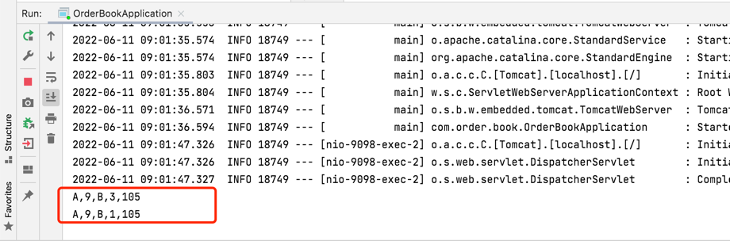

All orders with orderId=3 in the seller’s order book are matched and removed from the sell order book, and order with orderId=4 are matched with 1 share, leaving 6 shares. The buyer's order book remains unchanged.

Sell order book

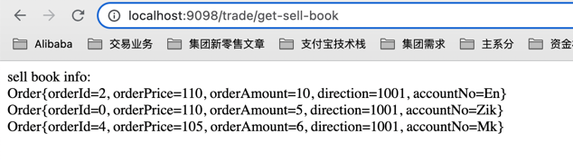

buy order book

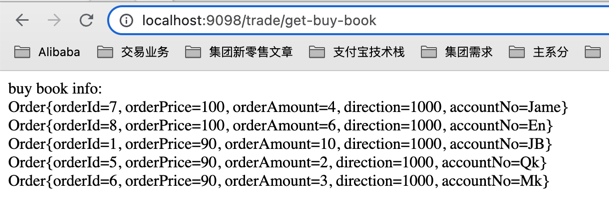

6. An aggressive seller who sells 23 shares at $80 will match the buyer's order book with 4 shares in orderId=7 + 6 shares in orderId=8 + 10 shares in orderId=1 + 2 shares in orderId=5 +orderId=6 1 share

Buy order book, there are 2 shares left with orderId=6

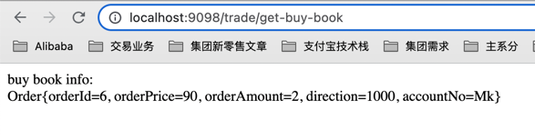

The latest transaction records are returned, and 5 transaction records are added.

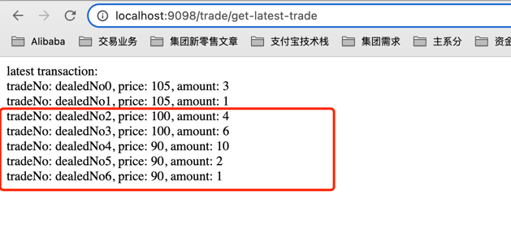

Standard log printing

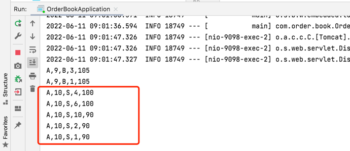

7. A buyer buys 8 shares at $107; at this time, the 6 shares with orderId=4 in the sell order book are matched, and the remaining 2 shares are not traded and are added to the buyer's order book

buy order book

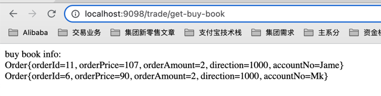

sell order book

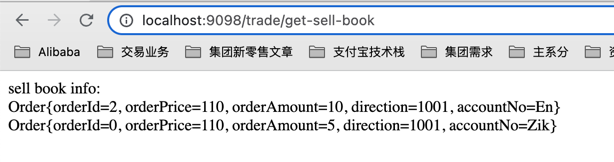

Standard log printing

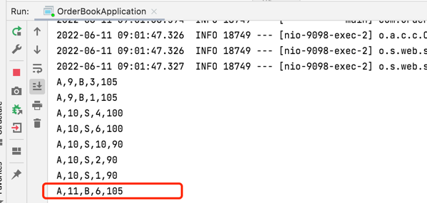

#### delete order

Orders left on the market

buy order book

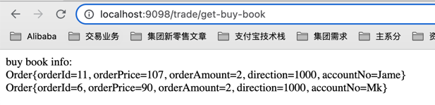

sell order book

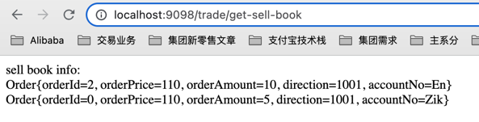

To delete the buy order with orderId=11, visit the delete order page（http://localhost:9098/cancel.html）

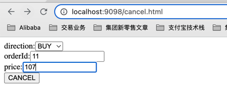

After delete the order, the order in the buy order book has been deleted

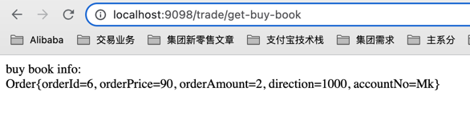

delete order standard log printing

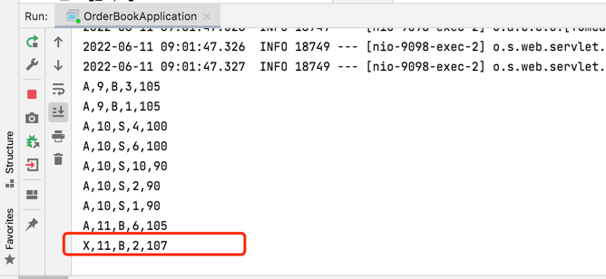

## Performance Testing

This performance test only includes the throughput and response time of the test interface.

Machine configuration: 8-core cpu, 16GB, system macOS

test interface: TradeEngine#processOrder()

test class: TradeEngineTest

| quantity of order | interface response time(ms)   | 
| ----- | --------- | 
| 100   |   10   |
| 1000  | 237     | 
| 10000  | 1280     | 
| 100000  | 12084     | 
| 100000  | 126618     | 

to be optimized：
1. The TradeEngine.processOrder method currently has a synchronization lock synchronized. How to optimize the lock granularity and improve the order processing capability?
2. Not taking full advantage of multithreading capabilities

